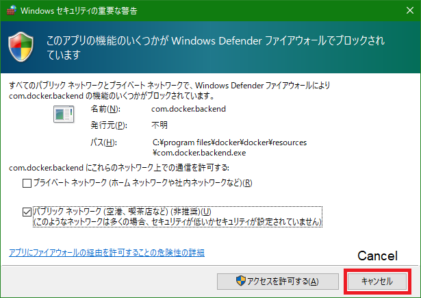

<!-- markdownlint-disable MD024 no-duplicate-heading -->
# FSWikiを手元のPCで利用するためのDockerfile、docker-compose.ymlなど

[English ](./README.md)

[FSWiki (FreeStyleWiki)](https://fswiki.osdn.jp/cgi-bin/wiki.cgi)は、Perl (とJavaScript<!-- for diffview-->)で書かれた Wikiクローンです。

## 本 Dockerfile 等で有効にしてある機能

詳しくは、[こちら](https://kazkobara.github.io/kati_dark/docs/markdown/markdown_plugin_for_fswiki.html)をご参照下さい。

- CSP (Content Security Policy) で保護された Markdown Plugin ([利用可能なMarkdown構文の一覧](https://kazkobara.github.io/kati_dark/docs/markdown/Help_Markdown_for_FreeStyleWiki.htm))
- MathJax を用いた LaTeX (および MathML) の表示
- localhost のみからの接続許可

> **注意:**
Dockerfile、docker-compose.ymlなどの設定を変更すれば外部からもアクセスできるようになるのですが、httpsの使用、パーミッションなど、セキュリティ上の設定にもご注意下さい。

## 使い方

シェル端末で以下のコマンドをご実行下さい。

### 1. Dockerfile 等の取得

#### 1.1 git clone とフォルダへの移動

~~~shell
git clone https://github.com/KazKobara/dockerfile_fswiki_local.git
~~~

~~~shell
cd dockerfile_fswiki_local
~~~

#### 1.2 `.env` ファイル中の変数を編集

~~~shell
vim .env
~~~

| 変数名 | 説明 |
|:---------|:----------|
| `FSWIKI_DATA_ROOT` | FSWiki のデータなどが格納される `attach/ config/ data/ log/` などを直下に含む親フォルダ名を指定\*1 |
| `CONTAINER_CLI` | 使用するコンテナCLI (`docker`, `nerdctl` など) を指定
| `COMPOSE` | 使用するコンテナコンポーザー (`docker-compose`, `nerdctl compose` など) を指定

> - \*1 FSWiki のどのフォルダを共有ボリュームとするかは、使用する`docker-compose.yml` または `run_fswiki_local.sh` で指定

#### 1.3 FSWiki やそのパッチなどを ./tmp/ フォルダ下にダウンロード

~~~shell
./get_fswiki.sh
~~~

### 2. ビルドと実行

以下のステップでは、お使いの環境などとの相性に応じて、[2a. Compose版](#2a-compose版)('[docker-compose](https://docs.docker.com/compose/reference/)', '[nerdctl](https://github.com/containerd/nerdctl#command-reference) compose' などを使う版)、または、[2b. シェルスクリプト版](#2b-シェルスクリプト版)のいずれかをご使用下さい。

また、Windows OS 上でのコマンド実行時に以下のようなウィンドウが表示された場合には、通信の許可は不要ですので、「キャンセル」ボタンをお押し下さい。

<!--

-->

#### 2a. Compose版

#### 2a.1 イメージのビルド

~~~shell
nerdctl compose build
~~~

または

~~~shell
docker-compose build
~~~

> - Windows版 のコマンドには `.exe` をお付け下さい。
> - Alpineイメージでのビルドでは git clone に時間が掛かります。
>   - 名前解決に時間を要しているのかもしれません。

#### 2a.2 実行

~~~shell
nerdctl compose up
~~~

または

~~~shell
docker-compose up
~~~

> バックグラウンドで実行する際には `-d` オプションを付けて下さい。

#### 2a.3 閲覧

Webブラウザで `http//localhost:<ポート番号>/` へご接続下さい。
ポート番号は `.env` ファイル中の `FSWIKI_PORT` で指定した番号になります
(例 `http//localhost:8366/`)。

#### 2a.4 プロセスの停止と削除

~~~shell
nerdctl compose down
~~~

または

~~~shell
docker-compose down
~~~

#### 2b. シェルスクリプト版

#### 2b.1 イメージのビルド

~~~shell
./docker_build.sh
~~~

> - Compose版と同様に、Alpineイメージでのビルドには時間が掛かります。

#### 2b.2 ローカル利用のためのWebサーバの起動

~~~shell
./run_fswiki_local.sh
~~~

#### 2b.3 閲覧

Webブラウザで `http//localhost:<ポート番号>/` へご接続下さい。
ポート番号は .env ファイル中の `FSWIKI_PORT` で指定した番号になります
(例 `http//localhost:8366/`)。

#### 2b.4 プロセスの停止と削除

~~~shell
nerdctl stop <container_name> && nerdctl rm <container_name>
~~~

または

~~~shell
docker stop <container_name> && docker rm <container_name>
~~~

ここで `<container_name>` は、Alpineのイメージを使う場合は `fswiki_alpine_local`、Debian/Ubuntuのイメージを使う場合は、
`fswiki_ubuntu_local` となります。

> Compose版の `<container_name>` には最後に `_dc` が付きます。

#### 2b.5 イメージの削除

~~~shell
nerdctl rmi <image_name>
~~~

または

~~~shell
docker rmi <image_name>
~~~

ここで `<image_name>` は `<container_name>:<fswiki_version>`、 `<fswiki_version>` は `latest`、 `3_8_5` などとなります。

### 3. アップデート/アップグレードのためのリビルド

#### 3.1 httpd のアップデート

Alpine イメージを使っている場合:

~~~shell
nerdctl pull httpd:alpine
~~~

または、

~~~shell
docker pull httpd:alpine
~~~

Debian/Ubuntu イメージを使っている場合:

~~~shell
nerdctl pull httpd:latest
~~~

または、

~~~shell
docker pull httpd:latest
~~~

#### 3.2 kati_dark テーマの更新

gitレポジトリの最新のFSWikiを使用している場合:

~~~shell
(cd ./tmp/wikilatest/theme/kati_dark && git pull)
~~~

FSWiki 3.5.6 を使用している場合:

~~~shell
(cd ./tmp/wiki3_6_5/theme/kati_dark && git pull)
~~~

#### 3.3 リビルドと実行

上記の [2. ビルドと実行](#2-ビルドと実行) を実行

<!--
~~~shell
docker-compose up --no-deps --build
~~~
-->

## 複数のサービスを実行する場合

[新たなフォルダを追加する方法](#方法1新たなフォルダを追加)と[既存のフォルダに追加する方法](#方法2既存フォルダに追加)があります。

### 方法1:新たなフォルダを追加

1. 上記 [1.1 git clone とフォルダへの移動](#11-git-clone-とフォルダへの移動) において、新たなフォルダに git clone します。
1. その新たなフォルダ内で、[docker-compose.yml](https://github.com/KazKobara/dockerfile_fswiki_local/blob/main/docker-compose.yml)の以下の説明に従い各変数を、既存の設定と被らないように変更

    ~~~yaml
    ##### To launch multiple independent docker processes #####
    ~~~

1. 上記 [1.2 .env ファイル中の変数を編集](#12-env-ファイル中の変数を編集) 以下を実行

### 方法2:既存フォルダに追加

1. `.env` ファイルの `FSWIKI_DATA_ROOT_PRIVATE` と `FSWIKI_PORT_PRIVATE` を編集
1. 以下のいづれかを実行:

    ~~~shell
    nerdctl compose -f docker-compose-multiple.yml up
    ~~~

    または、

    ~~~shell
    docker-compose -f docker-compose-multiple.yml up
    ~~~

    または、

    ~~~shell
    ./run_fswiki_private.sh
    ~~~

## Compose版とシェルスクリプト版の違い

- 割り当てられるネットワークアドレスとFSWikiサーバに接続可能な IP アドレスが異なります。
  - compose版では 10.0.0.0/24 が使われ、10.0.0.1 からの接続のみを受け付けます。
  - シェルスクリプト版(docker build)では 172.17.0.0/16 が使われ、172.17.0.1 からの接続のみを受け付けます。
  - 詳しくは、「[docker network の subnet を指定する際に使うべきでないネットワークアドレス](https://github.com/KazKobara/tips-jp/blob/gh-pages/docker/subnet.md)」もご参照下さい。

## イメージサイズ等の違い

|tag_version|fswiki|base|kernel|httpd|perl|Image Size[MB]|
| :---: | :---: | :--- | ---: | ---: | ---: | ---: |
|0.0.5|latest (4ba68e3)|Alpine 3.17 \*1|5.15.79.1|2.4.54|5.36.0|78.6|
|0.0.5|3_6_5|Alpine 3.17 \*1|5.15.79.1|2.4.54|5.36.0|73.5|
|0.0.5|latest (4ba68e3)|Debian 11|5.15.79.1|2.4.54|5.32.1|229|
|0.0.5|3_6_5|Debian 11|5.15.79.1|2.4.54|5.32.1|224|

> 以下のバージョンには脆弱性があります。アップデート方法は上記の [3. アップデート/アップグレードのためのリビルド](#3-アップデートアップグレードのためのリビルド)をご参照下さい。
>
> - [httpd 2.4.53 以前](https://httpd.apache.org/security/vulnerabilities_24.html)
> - [busybox 1.35 以前](https://cve.mitre.org/cgi-bin/cvekey.cgi?keyword=busybox)
>   - \*1 [Alpine 3.17 での状況](https://security.alpinelinux.org/branch/3.17-main): [CVE-2022-28391](https://security.alpinelinux.org/vuln/CVE-2022-28391), [CVE-2022-30065](https://security.alpinelinux.org/vuln/CVE-2022-30065)

イメージサイズの一覧は、以下のコマンドなどで調べられます。

~~~shell
nerdctl images | grep fswiki_
~~~

または、

~~~shell
docker images | grep fswiki_
~~~

バージョンは、上記コマンドで表示される `<container_name>` に対して、以下のスクリプトを実行するか、

~~~shell
./check_ver_in_container.sh <container_name>
~~~

以下のテストを実行することで得られます。

## テスト

1. `./test.sh` ファイル中の以下の箇所で、テストする項目を選択

    ~~~shell
    ## Uncomment one of them       # 以下のいずれか一つのコメントを外す
    TEST_PLATFORM="alpine ubuntu"  # AlpineとDebian/Ubuntu両方をテストする場合
    # TEST_PLATFORM="ubuntu"       # Debian/Ubuntuのみをテストする場合
    # TEST_PLATFORM="alpine"       # Alpineのみをテストする場合

    ## Comment out if not to test  # Compose版とシェルスクリプト版の両方をテストする場合は両方のコメントを外す
    TEST_COMPOSE_VER="Do"          # Compose版をテスト
    TEST_SHELL_VER="Do"            # シェルスクリプト版をテスト
    ~~~

1. `.env` ファイル中の `FSWIKI_DATA_ROOT` を(シェルスクリプト版をテストする場合は絶対パスで)指定
1. テストスクリプトを実行

    ~~~shell
    ./test.sh
    ~~~

## 設定

### ウェブセキュリティチェックのための設定

OWASP ZAP, Nikto などを利用し、他のコンテナからここで立ち上げたウェブサーバーのセキュリティチェックを行う際には、`.env` ファイルの `FSWIKI_PORT` の説明をご参照の上、設定をご変更下さい。

### パーミッションとグループの設定

`.env` ファイルで指定した `FSWIKI_DATA_ROOT` のファイルパーミッションとグループを設定するには、ホストOS上で `.env` ファイルと同じフォルダで以下のスクリプトを実行するか、

~~~console
./change_permissions.sh
~~~

`docker-compose.yml` または `run_fswiki_local.sh` で指定した共有ボリューム( attach/ config/ data/ log/ が指定してある場合)に対して、以下のコマンドを実行します。

> なお、コマンド実行後においても FSWiki がファイルを更新すると(umask に関係無く)、パーミッションは 644 となり、owner はコンテナOSの httpd_sub-processes の uid になります。

~~~console
chmod -R a-rwx,ug+rwX attach/ config/ data/ log/
chgrp -R <gid_of_httpd_sub-processes> attach/ config/ data/ log/
~~~

<!--find . -type f -executable -print-->

ここで `<gid_of_httpd_sub-processes>` には、コンテナOS(Base OS)に応じて、以下の番号を指定するか、コンテナOS上からであれば、`group`名を指定することが可能です(ホストOS上から設定する場合、コンテナOSの www-data に対応する番号が同じとは限らないため、番号で指定する必要があります)。

|<gid_of_httpd_sub-processes>|(uid_of_httpd_sub-processes)|group|base|httpd|
| :---: | :---: | :---: | :---: | :---: |
|33|(33)|www-data|Debian/Ubuntu|2.4.52|
|82|(82)|www-data|Alpine|2.4.52|
|1|(1)|daemon|Debian/Ubuntu|2.4.46|
|2|(2)|daemon|Alpine|2.4.46|

### 共有ボリュームを複数のOSで共有する際の設定

前述のとおり、OSにより httpd_sub-processes の uid と gid が異なるため、別コンテナの httpd_sub-processes の gid で共有ボリュームに書き込まれたファイルを、自コンテナの httpd_sub-processes が読めるようにする必要があります。

これは、例えば、別コンテナの httpd_sub-processes のグループに自コンテナの httpd_sub-processes の uid を追加することで実現できます。具体的には、Debian/Ubuntuコンテナ上では、以下のコマンドなどで Alpine の httpd_sub-process の gid である 82 番をもつ新たなグループ `www-data-alpine` を追加し、そのグループに Debian/Ubuntu の httpd_sub-process の uid である www-data を追加します。

  ~~~console
  addgroup --gid 82 www-data-alpine
  adduser www-data www-data-alpine
  ~~~

  <!-- addgroup is a symbolic link of adduser  -->

そして、Alpineコンテナ上では、以下のコマンドなどで Debian/Ubuntu の httpd_sub-process の gid である 33 番(xfs)のグループに Alpine の httpd_sub-process のユーザネーム www-data を追加します。

  ~~~console
  adduser www-data xfs
  ~~~

## エラー対処方法のヒント

### 'Permission denied' または 'Lock is busy'

ウェブブラウザに以下のようなエラーが表示された場合、上記の[パーミッションとグループの設定](#パーミッションとグループの設定)をお試し下さい。

  ~~~text
  Permission denied at lib/Wiki/DefaultStorage.pm line 114.
  ~~~

  ~~~text
  Permission denied: ./log at lib/CGI2.pm line 34.
  ~~~

  ~~~text
  You don't have permission to access this resource.
  ~~~

  ~~~text
  Lock is busy. at plugin/core/ShowPage.pm line 69. at lib/Util.pm line 743.
  ~~~

### Software Error

ウェブブラウザに以下のようなエラーが表示された場合、`.env` ファイルの `FSWIKI_DATA_ROOT` の説明を参考にしながら、共有ボリュームのパスをご指定下さい。実行環境により受け付けるパスの記述方法が異なります。

  ~~~text
  Software Error:
  HTML::Template->new() : Cannot open included file ./tmpl/site//. tmpl : file not found. at lib/HTML/Template.pm
  ~~~

### Can't locate CGI.pm

コンテナが以下のようなログを吐く場合、コンテナ内で、例えば Debian/Ubuntu の場合は `apt-get install -y libcgi-session-perl`、Alpineの場合には `apk add -y perl-cgi-fast` などのコマンドで Perl CGI をインストールして下さい。

  ~~~text
  Can't locate CGI.pm in @INC (you may need to install the CGI module) (...) at lib/CGI2.pm line 7.
  BEGIN failed--compilation aborted at lib/CGI2.pm line 7.
  ~~~

<!--
From v0.0.3, 'diff view' is available using CSP Hash without relying on 'unsafe-inline' or 'unsafe-hashes'!!

### To show difference in "Difference" menu

If inline scripts are not threatening, let the corresponding part in /usr/local/apache2/conf/extra/[`httpd-security-fswiki-local.conf`](https://raw.githubusercontent.com/KazKobara/dockerfile_fswiki_local/main/data/httpd-security-fswiki-local.conf) as follows:

~~~apache
Header always set Content-Security-Policy "default-src 'self'; script-src 'self' 'unsafe-inline';"
# Header always set Content-Security-Policy "default-src 'self';"
~~~

though CSP Hash or CSP Nonce is more ideal than 'unsafe-inline' after modification of scripts.
-->

## [CHANGELOG](./CHANGELOG.md)

## [LICENSE](./LICENSE)

---
最後までお読み頂きありがとうございます。
GitHubアカウントをお持ちでしたら、フォロー及び Star 頂ければと思います。リンクも歓迎です。

- [Follow (クリック後の画面左)](https://github.com/KazKobara)
- [Star (クリック後の画面右上)](https://github.com/KazKobara/dockerfile_fswiki_local)

[homeに戻る](https://kazkobara.github.io/README-jp.html)
