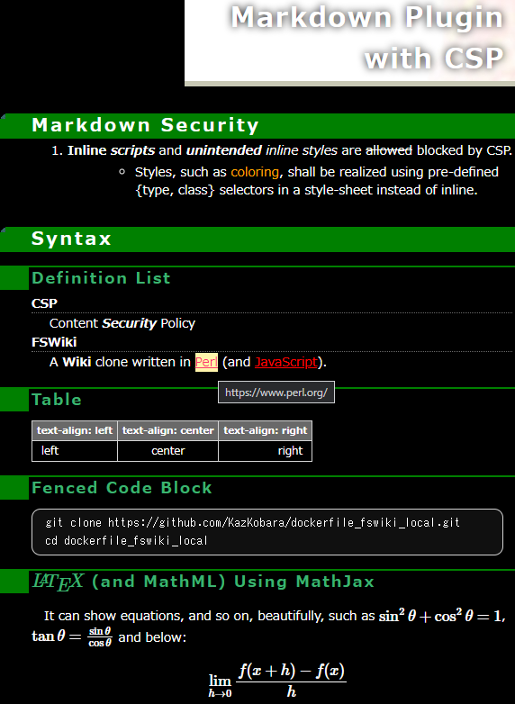

<!-- markdownlint-disable MD024 no-duplicate-heading -->
# Dockerfile and docker-compose.yml for local use FSWiki

[FSWiki (FreeStyleWiki)](https://fswiki.osdn.jp/cgi-bin/wiki.cgi) is a Wiki clone written in Perl (and JavaScript<!-- for diffview-->).

This Dockerfile is to launch FSWiki that is used only from a local web browser.


<!--

-->

> **CAUTION:**
To expose it to the public network, additional security considerations
would be necessary including https use, load-balancing, permissions
and so on.

## Features

Markdown Plugin with CSP (Content Security Policy), LaTeX (and MathML) rendering using MathJax.


<!--  -->

The above is the screenshot of the following markdown document (in a markdown block of FSWiki
in the ['kati_dark' theme](https://github.com/KazKobara/kati_dark "https://github.com/KazKobara/kati_dark (in Japanese)") where other themes are available from [here](https://fswiki.osdn.jp/cgi-bin/wiki.cgi?page=%A5%C6%A1%BC%A5%DE%B0%EC%CD%F7 "https://fswiki.osdn.jp/cgi-bin/wiki.cgi?page=%A5%C6%A1%BC%A5%DE%B0%EC%CD%F7 (in Japanese)").

<!--
Including "'markdown' in double curly braces", the tag to identify markdown blocks in FSWiki, here and below causes 
"Liquid Exception: Liquid syntax error (line 26): Variable" error in
"pages build and deployment pages build and deployment #6" for jekyll-theme-midnight.
 -->

~~~markdown
# Markdown Plugin with CSP

## Syntax

1. **Inline _scripts_** and _**unintended** inline styles_ are ~~allowed~~ blocked by CSP.
    - <span type="text/css" class="orange">Coloring</span> shall be realized using style-sheet defined {type, class} selectors.

### Definition List

CSP
: Content ___Security___ Policy

=FSWiki=
    A *Wiki* clone written in [Perl](https://www.perl.org/ "https://www.perl.org/") (and JavaScript).

### Table

<!-- Realizing 'text-align:' in a markdown table without using inline-style requires a tweak. -->

| text-align: left | text-align: center | text-align: right |
|:---------|:----------:|---------:|
| left     |   center   |    right |

### Fenced Code Block

```console
git clone https://github.com/KazKobara/dockerfile_fswiki_local.git
cd dockerfile_fswiki_local
```

### \\( \LaTeX \\) (and MathML) Using MathJax

<script id="MathJax-script" async src="https://cdn.jsdelivr.net/npm/mathjax@3/es5/tex-mml-chtml.js"></script>

It can show equations, and so on, beautifully, such as
\\( \sin^{2} \theta + \cos^{2} \theta = 1 \\),
\\( \tan \theta = \frac{\sin \theta}{\cos \theta} \\)  and below:
\\[ \lim_{h \to 0} \frac{f(x+h) - f(x)}{h} \\]

~~~

## How to use

Run the following commands on a shell terminal.

### 1. Get Dockerfile etc

#### 1.1 git clone and enter the folder

~~~shell
git clone https://github.com/KazKobara/dockerfile_fswiki_local.git
~~~

~~~shell
cd dockerfile_fswiki_local
~~~

#### 1.2 Edit parameters in `.env` file

Especially, `FSWIKI_DATA_ROOT` that has docker shared volumes specified in `docker-compose.yml` or `run_fswiki_local.sh`, typically `attach/ config/ data/ log/`.

~~~shell
vim .env
~~~

#### 1.3 Download FSWiki under ./tmp/

~~~shell
./get_fswiki.sh
~~~

In the following steps, you can choose either the docker-compose version or the shell script version, depending on your environment.

If they pop up the following window on Windows, click the "cancel" button to block the access from outside your PC.


<!--


-->

### 2. Docker-compose Version

#### 2.1 Build image

~~~shell
docker-compose build
~~~

or on Windows add `.exe` after docker-compose, such as

~~~shell
docker-compose.exe build
~~~

#### 2.2 Run

~~~shell
docker-compose up
~~~

To run it in the background, add `-d` option.

#### 2.3 Browse

Access `http//localhost:<FSWIKI_PORT specified in the .env file>/` such as `http//localhost:8366/` with your web browser.

#### Stop and remove the process

~~~shell
docker-compose down
~~~

For more options, cf. [reference of docker-compose](https://docs.docker.com/compose/reference/).

### 2. Shell Script Version

#### 2.1 Build image

~~~shell
./docker_build.sh
~~~

#### 2.2 Run server for local use

~~~shell
./run_fswiki_local.sh
~~~

#### 2.3 Browse

Access `http//localhost:<FSWIKI_PORT specified in the .env file>/` such as `http//localhost:8366/` with your web browser.

#### Stop and remove the process

~~~shell
docker stop <container_name> && docker rm <container_name>
~~~

where `<container_name>` is `fswiki_alpine_local_dc` or   `fswiki_ubuntu_local_dc` for docker-compose versions, and `fswiki_alpine_local` or   `fswiki_ubuntu_local` for shell script versions.

#### Remove the image

~~~shell
docker rmi <image_name>
~~~

where `<image_name>` is `<container_name>:<fswiki_version>` and `<fswiki_version>` is `latest`, `3_8_5`, and os on.

### 3. Rebuild for update/upgrade

#### 3.1 Update httpd

 Depending on the base os of the docker container, run the following:

For alpine:

~~~shell
docker pull httpd:alpine
~~~

For ubuntu:

~~~shell
docker pull httpd:latest
~~~

#### 3.2 Rebuild and run

Run step 2.

<!--
~~~shell
docker-compose up --no-deps --build
~~~
-->

## To run multiple/additional services

There are two ways to realize this, one creates new folders, the other uses one existing folder.

### In a new folder

1. git clone to another folder.
1. In the new folder, edit variables according to the section of
`##### To launch multiple independent docker processes #####` in
[docker-compose.yml](https://github.com/KazKobara/dockerfile_fswiki_local/blob/main/docker-compose.yml).
1. Run 1.2 and later.

### In an existing folder

  Edit `FSWIKI_DATA_ROOT_PRIVATE` and `FSWIKI_PORT_PRIVATE` in `.env`, then

  ~~~shell
  docker-compose -f docker-compose-multiple.yml up
  ~~~

  or

  ~~~shell
  ./run_fswiki_private.sh
  ~~~

## Differences between docker-compose and shell versions

- The differences are the network addresses to be assigned and IP addresses that can access the fswiki server in the docker network.
  - docker-compose uses 10.0.0.0/24 and httpd accepts access only from 10.0.0.1.
  - shell version (docker build) uses 172.17.0.0/16 and httpd accepts access only from 172.17.0.1.
  - See [this page](https://github.com/KazKobara/tips-jp/blob/gh-pages/docker/subnet.md) as well (after translation from Japanese).

## Docker Image Sizes

|tag_version|fswiki|base|kernel|httpd|perl|Image Size[MB]|
| :---: | :---: | :--- | ---: | ---: | ---: | ---: |
|0.0.2|latest (4ba68e3)|alpine|5.10.60.1, 4.19.76|2.4.52|5.34.0|71.6|
|0.0.2|3_6_5|alpine|5.10.60.1, 4.19.76|2.4.52|5.34.0|70.2|
|0.0.1|3_6_5|alpine|4.19.76|2.4.46 *1|5.30.3|62.1|
|0.0.2|latest (4ba68e3)|ubuntu|5.10.60.1|2.4.52|5.32.1|221|
|0.0.2|3_6_5|ubuntu|5.10.60.1|2.4.52|5.32.1|220|
|0.0.1|3_6_5|ubuntu|4.19.76|2.4.46 *1|5.28.1|209|

*1 httpd 2.4.51 and earlier have [vulnerabilities](https://httpd.apache.org/security/vulnerabilities_24.html), cf. step 3 to update httpd.

The following commands show the sizes and versions:

~~~shell
docker images | grep fswiki_
~~~

and

~~~shell
./check_versions.sh <container_name>
~~~

or the following test can show them too.

## TEST

Set `FSWIKI_DATA_ROOT` in `.env` as an absolute path to test shell version.

Edit the following parameters in `./test.sh`

~~~shell
## Edit here
# TEST_PLATFORM="alpine ubuntu"
TEST_PLATFORM="alpine"

## Comment out if not to test
TEST_DOCKER_COMPOSE="Do"
# TEST_SHELL_VERSION="Do"
~~~

then

~~~shell
./test.sh
~~~

<!--
============ Test Summary (e26268b) =============
====== Size (of all the 'fswiki_*' images) ======
fswiki_ubuntu_local            3_6_5      4a7281cbe640   3 seconds ago        250MB
fswiki_ubuntu_local_dc         3_6_5      648c48bdb7b3   43 seconds ago       250MB
fswiki_ubuntu_local            latest     8e0b91c54ee4   About a minute ago   251MB
fswiki_ubuntu_local_dc         latest     162522d657d4   2 minutes ago        251MB
fswiki_alpine_local            3_6_5      47733a5e6f48   2 minutes ago        73.8MB
fswiki_alpine_local_dc         3_6_5      9312e94d8b3e   13 minutes ago       73.8MB
fswiki_alpine_local            latest     c73fdd6ad2d4   23 minutes ago       75.2MB
fswiki_alpine_local_dc         latest     d66e553ed271   34 minutes ago       75.2MB

=== Versions of fswiki_alpine_local_dc:latest ===
5.10.60.1-microsoft-standard-WSL2
Apache/2.4.52
perl(v5.34.0)
-------------------------------------------------
=== Versions of fswiki_alpine_local:latest ======
5.10.60.1-microsoft-standard-WSL2
Apache/2.4.52
perl(v5.34.0)
-------------------------------------------------
=== Versions of fswiki_alpine_local_dc:3_6_5 ====
5.10.60.1-microsoft-standard-WSL2
Apache/2.4.52
perl(v5.34.0)
-------------------------------------------------
=== Versions of fswiki_alpine_local:3_6_5 =======
5.10.60.1-microsoft-standard-WSL2
Apache/2.4.52
perl(v5.34.0)
-------------------------------------------------
=== Versions of fswiki_ubuntu_local_dc:latest ===
5.10.60.1-microsoft-standard-WSL2
Apache/2.4.52
perl(v5.32.1)
-------------------------------------------------
=== Versions of fswiki_ubuntu_local:latest ======
5.10.60.1-microsoft-standard-WSL2
Apache/2.4.52
perl(v5.32.1)
-------------------------------------------------
=== Versions of fswiki_ubuntu_local_dc:3_6_5 ====
5.10.60.1-microsoft-standard-WSL2
Apache/2.4.52
perl(v5.32.1)
-------------------------------------------------
=== Versions of fswiki_ubuntu_local:3_6_5 =======
5.10.60.1-microsoft-standard-WSL2
Apache/2.4.52
perl(v5.32.1)
-------------------------------------------------
-->

## Settings

### Web Security Check

To allow access from other docker containers for web security check using OWASP ZAP, Nikto and so on, edit `FSWIKI_PORT` in `.env` and set their target IP addresses to any IP address assigned to the host OS.

### Help of Markdown Plugin with CSP, LaTeX and MathML rendering using MathJax

- On your web browser displaying FSWiki launched by this docker file, click and see `Help/Markdown` in the menu (after translation from Japanese).

Or

1. Get the HTML files:

    ~~~shell
    git clone https://github.com/KazKobara/kati_dark.git
    cd ./kati_dark/docs/markdown/
    ~~~

1. Open Help_Markdown_for_FreeStyleWiki.htm with your web browser
1. (Translate Japanese to your language).

<!--
[Help/Markdown (FSWiki file)]: https://github.com/KazKobara/kati_dark/blob/main/docs/markdown/Help%252FMarkdown.wiki

[Help/Markdown (HTML file)]: https://github.com/KazKobara/kati_dark/blob/main/docs/markdown/Help_Markdown_for_FreeStyleWiki.htm

[Markdown Plugin]: https://github.com/KazKobara/kati_dark/blob/main/docs/markdown/markdown_plugin_for_fswiki.md
-->

### Permissions and group

Check and/or edit `FSWIKI_DATA_ROOT` in `.env`. Then in the same folder as `.env`, run

~~~console
./change_permissions.sh
~~~

Alternatively, set manually permissions and group of folders (and their files), which are under `FSWIKI_DATA_ROOT` folder set in `.env`, and where `docker-compose.yml` or `run_fswiki_local.sh` specifies.
If the folders are `attach/ config/ data/ log/`, the commands are as follows:

  ~~~console
  chmod -R a-rwx,ug+rwX attach/ config/ data/ log/
  chgrp -R <gid_of_httpd_sub-processes> attach/ config/ data/ log/
  ~~~

 <!--find . -type f -executable -print-->

where `<gid_of_httpd_sub-processes>` is

|<gid_of_httpd_sub-processes>|(uid_of_httpd_sub-processes)|group|base|httpd|
| :---: | :---: | :---: | :---: | :---: |
|33|(33)|www-data|ubuntu|2.4.52|
|82|(82)|www-data|alpine|2.4.52|
|1|(1)|daemon|ubuntu|2.4.46|
|2|(2)|daemon|alpine|2.4.46|

> **NOTE:** `gid` is needed since `gid` may differ between host and guest of the docker container. If you change it in the container, you can use `group` name instead of `gid`.

### Permission to share data volume on multiple Operating Systems

On each OS, add the username of the httpd_sub-process of the OS to the group corresponding to the other OS, e.g., to share Alpine folders on Ubuntu:

  ~~~console
  addgroup --gid 82 www-data-alpine
  addgroup www-data www-data-alpine
  ~~~

and vice versa on Alpine:

  ~~~console
  addgroup www-data xfs
  ~~~

where gid of xfs is 33 whose group is www-data on Ubuntu.

## Trouble-shooting

### 'Permission denied' or 'Lock is busy'

If your web browser displays any of the following errors,

  ~~~text
  Permission denied at lib/Wiki/DefaultStorage.pm line 114.
  ~~~

  ~~~text
  Permission denied: ./log at lib/CGI2.pm line 34.
  ~~~

  ~~~text
  You don't have permission to access this resource.
  ~~~

  ~~~text
  Lock is busy. at plugin/core/ShowPage.pm line 69. at lib/Util.pm line 743.
  ~~~

check and change file permissions and group as above.

### Software Error

If your web browser displays the following error, check or change `FSWIKI_DATA_ROOT` in .env file. Docker for Windows does not mount some folders to docker containers.

  ~~~text
  Software Error:
  HTML::Template->new() : Cannot open included file ./tmpl/site//. tmpl : file not found. at lib/HTML/Template.pm
  ~~~

### Can't locate CGI.pm

If the docker outputs the following log, install Perl CGI with `apt-get install -y libcgi-session-perl` for Ubuntu, `apk add -y perl-cgi-fast` for Alpine, and so on.

  ~~~text
  Can't locate CGI.pm in @INC (you may need to install the CGI module) (...) at lib/CGI2.pm line 7.
  BEGIN failed--compilation aborted at lib/CGI2.pm line 7.
  ~~~

<!--
From v0.0.3, 'diff view' is available using CSP Hash without relying on 'unsafe-inline' or 'unsafe-hashes'!!

### To show difference in "Difference" menu

If inline scripts are not threatening, let the corresponding part in /usr/local/apache2/conf/extra/[`httpd-security-fswiki-local.conf`](https://raw.githubusercontent.com/KazKobara/dockerfile_fswiki_local/main/data/httpd-security-fswiki-local.conf) as follows:

~~~apache
Header always set Content-Security-Policy "default-src 'self'; script-src 'self' 'unsafe-inline';"
# Header always set Content-Security-Policy "default-src 'self';"
~~~

though CSP Hash or CSP Nonce is more ideal than 'unsafe-inline' after modification of scripts.
-->

## [CHANGELOG](./CHANGELOG.md)

## [LICENSE](./LICENSE)

---

- [https://github.com/KazKobara/](https://github.com/KazKobara/)
- [https://kazkobara.github.io/ (mostly in Japanese)](https://kazkobara.github.io/)
